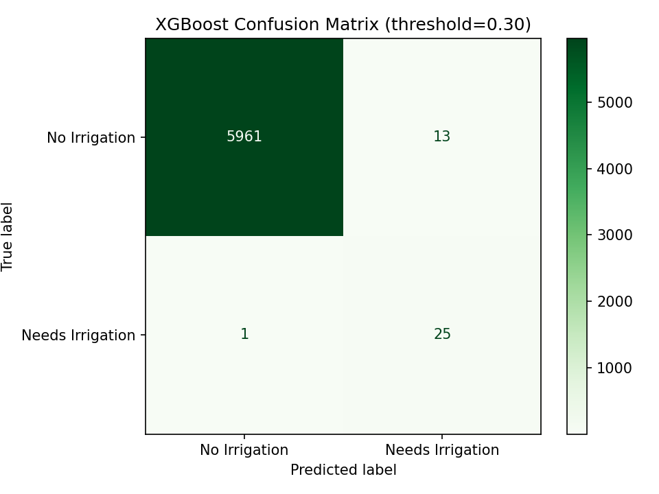
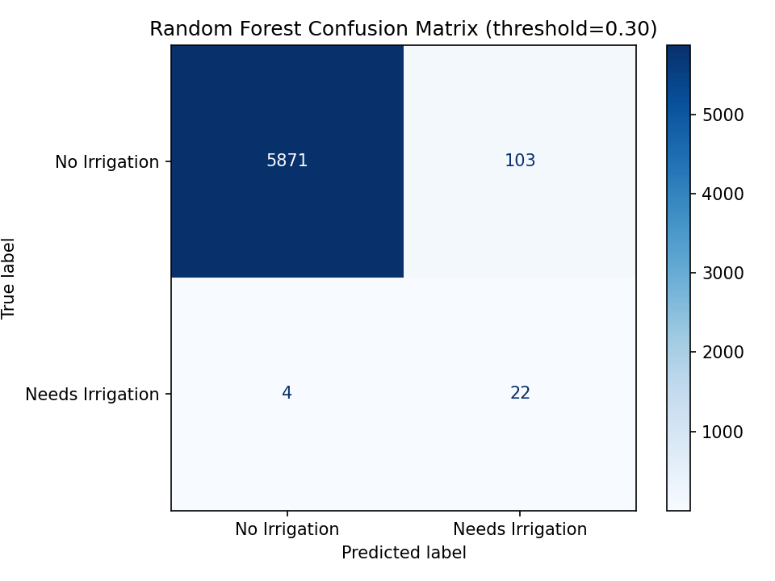

# 🌾 Smart Farming – Irrigation Prediction

> ML-powered binary classification model to predict whether crops need irrigation — built to handle extreme class imbalance using SMOTETomek + XGBoost.


---

## 📌 Project Overview

This project applies supervised machine learning to agriculture — predicting whether a crop needs irrigation based on **soil conditions** and **weather parameters**. The key challenge was an extreme class imbalance: only **0.4% of records** (129 out of 30,000) required irrigation.

---

## 📊 Dataset

| Property | Value |
|---|---|
| Total records | 30,000 |
| Features | 25 (after encoding) |
| Target: No Irrigation (0) | 29,871 (99.6%) |
| Target: Needs Irrigation (1) | 129 (0.4%) |
| Source | Smart Farming Irrigation Dataset |

**Key features:** soil moisture, rootzone moisture, crop type, crop stage, soil texture, precipitation, temperature, humidity, wind speed, solar radiation, evapotranspiration

---

## ⚠️ Challenge: Extreme Class Imbalance

With only 0.4% positive cases, a naive model would achieve 99.6% accuracy by always predicting "No Irrigation" — completely useless in practice.

**Solution:** SMOTETomek (oversampling + boundary cleaning) + threshold tuning at 0.30 instead of default 0.50

---

## 🤖 Models & Results

### XGBoost ✅ (Best Model)

| Class | Precision | Recall | F1 |
|---|---|---|---|
| No Irrigation | 1.00 | 1.00 | 1.00 |
| **Needs Irrigation** | **0.66** | **0.96** | **0.78** |

**Catches 25 out of 26 irrigation cases — missing only 1.**



---

### Random Forest (Comparison)

| Class | Precision | Recall | F1 |
|---|---|---|---|
| No Irrigation | 1.00 | 0.98 | 0.99 |
| Needs Irrigation | 0.18 | 0.85 | 0.29 |



> XGBoost outperforms Random Forest significantly on the minority class — higher recall (0.96 vs 0.85) and far better F1 (0.78 vs 0.29).

---

## 🔧 ML Workflow

```
Raw Data (30,000 rows)
        ↓
Data Cleaning & Feature Selection
        ↓
Leakage Removal (irrigation_amount_mm, threshold_vol excluded)
        ↓
One-Hot Encoding (crop_type, soil_texture, crop_stage)
        ↓
Stratified Train-Test Split (80/20)
        ↓
SMOTETomek (sampling_strategy=0.3)
        ↓
XGBoost Training (scale_pos_weight tuned)
        ↓
Threshold Tuning (sweep 0.10–0.55 → best = 0.30)
        ↓
Final Evaluation (5 metrics)
```

---

## 💡 Key Design Decisions

- **SMOTETomek over plain SMOTE** — handles extreme imbalance better by also removing noisy boundary samples
- **Threshold = 0.30 instead of 0.50** — optimized for recall since missing an irrigation need = crop damage
- **Leakage fix** — removed `irrigation_amount_mm` and `threshold_vol` which directly derive from the target
- **scale_pos_weight** — further compensates for class imbalance during XGBoost training

---

## 🗂️ Repository Structure

```
smart-farming-irrigation-prediction/
│
├── smartfarming.ipynb                          # Full notebook with outputs
├── smart_farming_irrigation_dataset_cleaned.xlsx  # Cleaned dataset
├── xgboost_confusion_matrix.png               # XGBoost results visual
├── rf_confusion_matrix.png                    # Random Forest results visual
├── requirements.txt                           # Dependencies
└── README.md
```

---

## 🚀 How to Run

```bash
# Clone the repo
git clone https://github.com/krishas-7/smart-farming-irrigation-prediction.git
cd smart-farming-irrigation-prediction

# Install dependencies
pip install -r requirements.txt

# Open notebook
jupyter notebook smartfarming.ipynb
```

Or run directly on **Google Colab** — upload the dataset when prompted.

---

## 📦 Requirements

```
pandas
numpy
matplotlib
scikit-learn
xgboost
imbalanced-learn
openpyxl
```

---

*Built by [Krisha Shah](https://www.linkedin.com/in/krishas7) · Mumbai, India*
